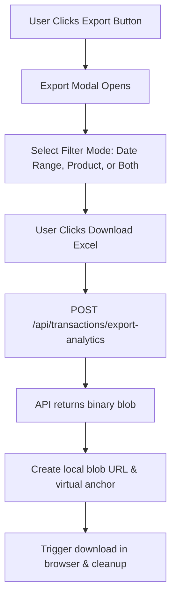

# Export Data Feature Report — Zeal Healing Billing Analytics

## 1. Feature Overview
The **Export Data** option on the Analytics & Transactions page is a reporting tool designed to generate auditing-ready, multi-sheet Excel workbooks (`.xlsx`) based on transactional history. Users can apply dynamic filters (by date range, specific products, or a combination of both) and download a structured spreadsheet compiled instantly by the server. 

---

## 2. User Interface & Frontend Workflow
The export workflow is triggered via the **Export Analytics** button on the `Transactions` screen:

### A. Filter Modalities
The frontend modal (`ExportModal`) supports three filtering modes:
1.  **By Date Range** (`date`): Allows choosing a `startDate` and `endDate` via native calendar inputs.
2.  **By Product** (`product`): Offers a searchable checklist of all registered products fetched from `/api/products`.
3.  **Both Filters** (`both`): Enables intersection filtering (e.g., retrieve sales of *Crystal Bracelets* between *April 1st* and *May 31st*).

### B. Intelligent Filename Conventions
The frontend dynamically names the downloaded file to make file management simple:
*   **With Date Range Active**: Formatted as `Sale_Report_DD-MM-YYYY_to_DD-MM-YYYY.xlsx` based on the selected boundaries.
*   **Without Date Range**: Defaults to `Sale_Report_DD-MM-YYYY.xlsx` using the current calendar date.

---

## 3. Backend Processing (`/api/transactions/export-analytics`)
Upon receiving the export request, the FastAPI backend queries MongoDB and constructs the spreadsheet in memory using `openpyxl`.

### A. Query Execution
*   **Date Filter**: Parses inputs into Python `datetime` objects. Queries the `timestamp` field in MongoDB using boundary expressions (`$gte` and `$lte`).
*   **Product Filter**: Compiles case-insensitive regex patterns matching the selected product list against the `product` string field in transactions.

### B. Style Sheet Specifications
The workbook applies professional formatting matching standard accounting templates:
*   **Headers**: Deep navy fill (`#1e293b`), bold white Calibri text, centered text alignment with borders.
*   **Gridlines**: Thin light-grey borders (`#e2e8f0`) wrapped around every cell.
*   **Totals**: Bold green text (`#10b981`) highlighted by a soft green fill (`#f0fdf4`).
*   **Auto-Fit Columns**: Calculates the maximum string width in each column and sets column widths dynamically to prevent layout truncation.

---

## 4. Spreadsheet Layout & Sheet Mapping

The generated workbook contains **two dedicated sheets**:

### Sheet 1: "Sale Report" (Transaction Ledger Summary)
This sheet acts as a financial ledger summarizing entire transactions.

*   **Metadata (Top Rows)**:
    *   Row 1: Includes an italicized timestamp: `Generated on Month DD, YYYY at HH:MM am/pm`
    *   Row 3: Lists the `UserName` of the operator executing the export.
*   **Table Headers (Row 4)**:
    1.  `Date` (formatted as `DD/MM/YYYY`)
    2.  `Party Name`
    3.  `Phone No.`
    4.  `Party's GSTIN No.` (if applicable)
    5.  `Order No.`
    6.  `Invoice No.` (formatted as `ZH-FY25-26/150614` with dynamic Financial Year)
    7.  `Transaction Type` (always defaulted to `"Sale"`)
    8.  `Total Amount` (Right-aligned double, including GST)
    9.  `Payment Type` (displays the GPay/UPI Transaction Reference ID)
    10. `Received Amount` (amount paid by the customer)
    11. `Balance Amount` (outstanding balance)
    12. `Description` (staff notes)
*   **Ledger Totals (Bottom Row)**: Sums up `Total Amount`, `Received Amount`, and `Balance Amount` in the accounting style.

---

### Sheet 2: "Sale Items" (Granular Line-Item Details)
This sheet details individual line-items within transactions, breaking down quantities, units, discounts, and GST.

*   **Metadata (Top Rows)**: Lists the exporting user.
*   **Table Headers (Row 2)**:
    1.  `Date`
    2.  `Party Name`
    3.  `Invoice No.`
    4.  `Item Name`
    5.  `Item code`
    6.  `HSN/SAC`
    7.  `Quantity` (formatted as decimal)
    8.  `Unit` (dynamically resolves to `"Nos"` for classes, healings, and consultations; or `"1"` for crystals and physical products)
    9.  `Price/Unit` (net base price excluding GST)
    10. `Discount` (formatted as `discount_amount(discount_percentage%)` e.g., `0.00(0.0%)`)
    11. `GST` (formatted as `gst_amount(gst_percentage%)` e.g., `18.00(18.0%)`)
    12. `Amount` (total line item cost including GST)

---

## 5. Architectural Strengths & Fallbacks
*   **Streamed Responses**: Uses FastAPI's `StreamingResponse` to push the binary file directly from the server buffer (`io.BytesIO`) without creating temporary garbage files on the server host.
*   **Fuzzy Item Fallback**: If legacy transactions lack structured line-items (`invoice_items` array), the parser automatically falls back to generating a single dummy row matching the transaction's aggregate fields, keeping data representation accurate.
