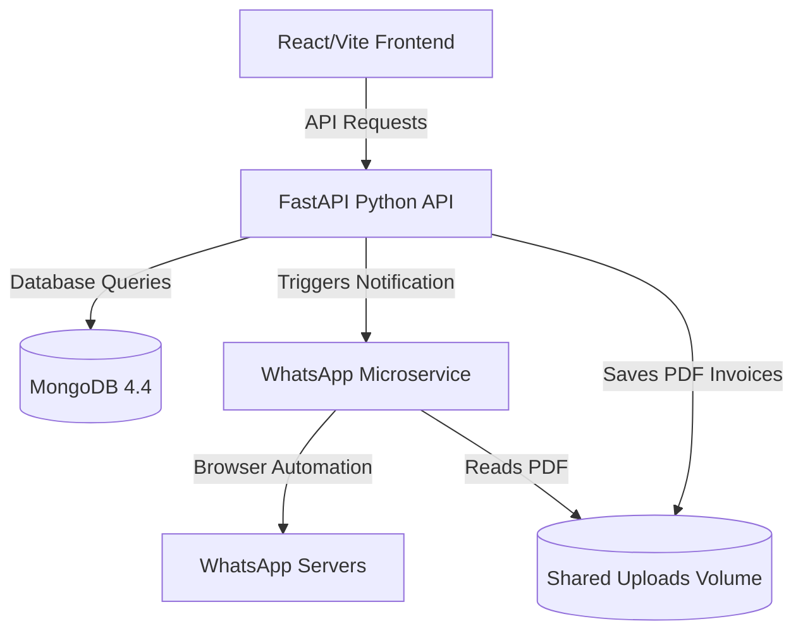

# Zeal Healing Billing System — Project Report

## 1. Executive Summary
The **Zeal Healing Billing System** is an enterprise-grade billing, analytics, and notification platform tailored for Zeal Healing's educational classes, healing sessions, consultations, and crystals/products catalog. The system automates transactional tracking, generates digital GST-compliant invoices in PDF format, syncs customer database profiles dynamically, and facilitates instant delivery of bills/receipts to clients via WhatsApp notifications.

---

## 2. System Architecture & Tech Stack
The platform uses a **Dockerized four-tier container architecture**, ensuring complete separation of concerns and high portability:



### Tech Stack Details
*   **Frontend**: Developed using **React 19** and **Vite**, styled using **Tailwind CSS v4** for a responsive interface. Iconography is handled via **Lucide React**, and charts/graphs are rendered using **Recharts**.
*   **Backend**: Powered by **FastAPI** (Python 3.10+), offering high performance, automatic OpenAPI documentation, and asynchronous handling. Database communication utilizes the **Motor** asynchronous MongoDB driver.
*   **WhatsApp Microservice**: An **Express.js** application driving **whatsapp-web.js** and **Puppeteer**. It automates a headless Chromium instance to authenticate, link devices, and send messages with media attachments.
*   **Database**: **MongoDB 4.4**, providing flexible document storage for transactions, products, and customer profiles.

---

## 3. Core Modules & Features

### A. Dashboard & Analytics
*   **Dynamic Financial Year Filtering**: Automatically segments transactions into Indian Financial Years (April 1st to March 31st) based on transaction timestamps (e.g., `25-26`).
*   **Metrics & KPIs**: Displays total revenue, total collected amount, outstanding balance, pending syncs, and system health status.
*   **Top Performers Charts**: Renders top-selling courses/products and top spending clients using Recharts.
*   **Customer Visits Normalization**: Normalizes customer names and phone numbers to resolve duplicates and compute exact visitation frequencies.

### B. Transaction & Billing Management
*   **Manual Invoicing**: Allows staff to input transactions. The system fetches the official product prices, calculates CGST/SGST/IGST automatically based on customer region (India vs. Abroad), and formats invoices.
*   **Batch Excel Upload Parser**: Parses uploaded transaction spreadsheets (`.xlsx`/`.csv`). Features smart matching algorithms, using category heuristics to automatically register new products, calculate tax breakdowns, and assign sequential invoice numbers.
*   **Payment Proof Uploads**: Supports linking transaction records with payment screenshot images/PDF files. These proofs are stored securely in `/uploads/payment_proofs/`.
*   **Invoice Regeneration & Scaling**: Allows editing transactions. Changing the total amount automatically scales item subtotals and tax components proportionally.

### C. Automated Document Generation
*   **FastAPI PDF Compiler**: Utilizes the **ReportLab** library to generate GST-compliant, print-ready PDF invoices.
*   **Dynamic Word Conversions**: Automatically translates numeric currency amounts into words (e.g., *“Rupees One Thousand Only”*) for invoice legibility.
*   **Structured Breakdowns**: Generates comprehensive tax grids displaying HSN codes, taxable values, CGST, and SGST percentages.

### D. WhatsApp Notification Pipeline
*   **LocalAuth Device Persistence**: Stores authentication tokens in a Docker volume (`.wwebjs_auth`) to preserve active user login sessions.
*   **Attachment Sharing**: WhatsApp microservice binds the backend's `uploads` directory, allowing it to send the newly compiled PDF invoices as direct message attachments.
*   **Stability Enhancements**: Pre-checks numbers against registered WhatsApp targets, inserts deliberate staggered throttling delays (1.5 seconds) to avoid spam flags, and clears stale browser lock files (`SingletonLock`, `SingletonSocket`) on initialization.

---

## 4. Database Schema Specification

### Users (`users`)
Tracks account credentials and authorization scopes.
```json
{
  "_id": "ObjectId",
  "username": "string",
  "hashed_password": "string",
  "role": "string" // "admin" or "staff"
}
```

### Products (`products`)
Houses catalog pricing and tax configurations.
```json
{
  "_id": "ObjectId",
  "name": "string",
  "category": "string", // Classes, Crystals, Healing, Medicine, Tarot
  "sub_category": "string",
  "price_india": "double",
  "price_abroad": "double",
  "gst_rate": "double", // e.g., 18.0, 5.0, 0.25
  "hsn_code": "string",
  "is_service": "boolean"
}
```

### Transactions (`transactions`)
The primary ledger document capturing client purchases, invoicing metadata, and status.
```json
{
  "_id": "ObjectId",
  "name": "string",
  "phone": "string",
  "email": "string",
  "transaction_id": "string",
  "amount": "double", // Subtotal excluding GST
  "product": "string",
  "date": "string",
  "location": "string", // "India" or "Abroad"
  "invoice_items": [
    {
      "name": "string",
      "qty": "int",
      "price": "double",
      "gst_rate": "double",
      "gst_amount": "double",
      "total": "double",
      "hsn": "string"
    }
  ],
  "gst_breakdown": [
    {
      "rate": "double",
      "cgst": "double",
      "sgst": "double",
      "total": "double"
    }
  ],
  "shipping": "double",
  "gst_total": "double",
  "total_amount": "double", // Grand total including GST
  "paid_amount": "double",
  "balance": "double",
  "status": "string", // "Pending", "Verified", "Rejected"
  "invoice_url": "string",
  "payment_proof_url": "string",
  "payment_proof_filename": "string",
  "payment_proof_uploaded_at": "ISODate",
  "timestamp": "ISODate",
  "invoice_number": "int",
  "added_by": "string",
  "batch_id": "string"
}
```

### Customers (`customers`)
Tracks consolidated customer spending. Updates automatically on transaction changes.
```json
{
  "_id": "ObjectId",
  "name": "string",
  "phone": "string",
  "total_spent": "double",
  "total_transactions": "int"
}
```

---

## 5. Recent Optimization & Stability Logs

### Nginx Rate-Limit Tuning
Resolved `503 Service Unavailable` errors during concurrent batch transactions on AWS deployment by refining Nginx buffer and rate parameters in proxy configurations.

### Sequenced API Request Synchronizations
Refactored frontend page initializations (e.g., `Dashboard.jsx`, `Transactions.jsx`) to remove parallel `Promise.all` requests that overloaded the FastAPI worker thread, replacing them with sequential request queues.

### WhatsApp Microservice Lock Clears
Added a cleanup routine in `whatsapp-service/index.js` that checks for and unlinks stale `SingletonLock` and `SingletonSocket` files on container start to prevent Puppeteer execution crashes.

---

## 6. Development & Production Operations

### Docker Compose Configuration
```yaml
version: '3.8'
services:
  mongodb:
    image: mongo:4.4
    restart: unless-stopped
    ports:
      - "27017:27017"
    volumes:
      - mongodb_data:/data/db

  backend:
    build: ./backend
    restart: unless-stopped
    ports:
      - "8000:8000"
    environment:
      - MONGO_URI=mongodb://mongodb:27017/
      - MONGO_DB=zeal_billing_db
      - WA_SERVICE_URL=http://whatsapp-service:3001
    depends_on:
      - mongodb
    volumes:
      - ./backend/uploads:/app/uploads

  frontend:
    build: ./frontend
    restart: unless-stopped
    ports:
      - "3000:3000"
    depends_on:
      - backend

  whatsapp-service:
    build: ./whatsapp-service
    restart: unless-stopped
    ports:
      - "3001:3001"
    volumes:
      - ./whatsapp-service/.wwebjs_auth:/app/.wwebjs_auth
      - ./backend/uploads:/app/uploads
    depends_on:
      - backend

volumes:
  mongodb_data:
```

### Deployment Architecture
*   **Host**: AWS EC2 running Ubuntu Server.
*   **Process Management**: PM2 monitoring microservices.
*   **Web Server**: Nginx handling HTTPS termination and reverse-proxying port `3000` (Frontend), `8000` (API), and `3001` (WhatsApp QR dashboard).
